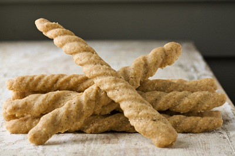

# Cheese Straws

*Perfect to nibble on with an aperitif, cheese straws are also good served along side a bowl of chicken consommé.*

**Makes:** makes 24

## Ingredients
- 400 grams puff pastry
- eggwash (1 egg yolk mixed with 1 tablespoon milk)
- 80 grams Emmenthal or Parmesan (freshly grated)
- 1 teaspoon sweet paprika
- pinch of cayenne pepper

## Method
### Prepare the pastry
1. On a lightly floured surface, roll out the pastry 20 a 28 x 12 cm rectangle, about 2 mm thick.
1. Roll it loosely over a rolling pin and unroll it onto a baking sheet lined with greaseproof paper.
1. Refrigerate for 20 minutes.

### Baking the straws
1. Preheat the oven to 180°C.
1. Brush the entire surface of the pastry with eggwash and sprinkle on the grated cheese evenly.
1. Mix the paprika and cayenne together and dust over the surface.
1. Use a chef's knife to trim and neaten the edges of the pastry, then halve it length ways to make 2 bands, each measuring 14 x 12 cm.
1. Cut each piece into 1 cm wide strips, making 24 straws.
1. Lift each cheese straw with a palette knife, hold both ends and twist them 5 times in opposite directions to make a spiral.
1. Baking the straws
1. Put the straws on a baking sheet and bake for 5 - 6 minutes.
1. Remove from the oven and immediately transfer to a wire rack carefully.
1. Leave to cool slightly.

### Serving
1. Arrange the straws in a tall goblet or on a plate and serve, preferably while still warm.