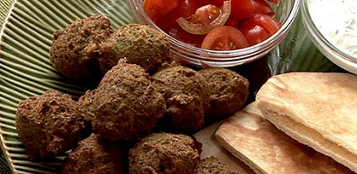

# Falafel

*Falafel are small bean, chickpea or lentil rissoles eaten with Tahina dip, or in pitta bread with an Egyptian style salad.*

**Preparation time**
- 8 hours soaking
- 10 minutes cooking
- 2 hours resting

## Ingredients
- 250 grams dried broad beans
- 1 tablespoon parsley (very finely chopped)
- 1 tablespoon coriander (very finely chopped)
- 4 spring onions (green stem, finely chopped)
- 1 garlic clove (finely chopped)
- ½ teaspoon ground cumin
- salt and pepper (to taste)
- small pinch bicarbonate of soda
- oil (for semi-deep frying)

## Method
1. Wash the beans and soak them in plenty of water for 8 hours.
1. Remove any debris from the water.
1. Drain the beans and dry them in kitchen paper.
1. Grind the beans in a mincer, using the fine disc or in a food processor until the beans have a consistency of a fairly dry, slightly grainy purée.
1. Mix the chopped herbs with the beans in a bowl.
1. Add the garlic and spring onions to the beans, along with the ground cumin, a little salt and pepper and a pinch of bicarbonate of sofa.
1. Knead the mixture well.
1. Taste and adjust the seasoning if necessary.
1. The mixture will be a pale green colour, speckled with dark green.
1. Leave the paste to rest, uncovered, in the refrigerator for a couple of hours to dry out.
1. Using damp hands, take a piece of paste the size of a large marble and knead it in the palm of your hand to form a ball.
1. Put the ball on a plate, and slightly flatten with your finger.
1. Repeat with the rest of the paste.
1. Chill in the refrigerator for at least half an hour.
1. Pour oil in a karahi or wok so that it is about 3 cm deep.
1. Heat the oil and fry the rissoles, turning them until they are golden brown on both sides. If they begin to turn a dark brown, reduce the heat.
1. Remove from the pan and drain on paper, cook the remaining rissoles the same way.
1. Serve with a selection of breads and dips.