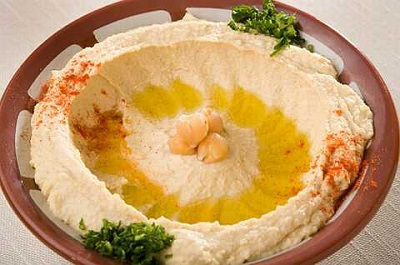

# Hummus

*This plain but agreeable dip made from chickpeas is popular all over the Middle East. The addition of tumeric really makes this dish stand out, and other flavourings can be added such as chilli or ginger.*

**Preparation time**
- 8 hours soaking
- 1 hour 30 minutes

## Ingredients
- 120 grams chickpeas
- 1 medium onion (very finely chopped)
- 1 garlic clove (very finely chopped)
- 20 ml olive oil
- ½ teaspoon tumeric
- salt (to taste)
- juice of ½ lemon

## Method
1. Wash the chickpeas and leave them to soak in plenty of water for 8 hours.
1. Discard any floating debris, then remove the chickpeas, reserving the water. If necessary, peel the chickpeas by rubbing them between your hands.
1. Add 1 tablespoon of oil to a pan, and heat gently.
1. Add the onion and garlic to the pan and gently cook until softened.
1. When the onion becomes translucent, stir in the tumeric and a little of the soaking water from the chickpeas.
1. Add the chickpeas and cover with enough of the soaking water to reach about 3 cm above the level of the peas.
1. Bring the water to the boil.
1. Immediately reduce the heat to low, and simmer for about an hour.
1. When the chickpeas are soft, drain them and reserve the liquid.
1. Mash the chickpeas with a fork and add a little of the reserved liquid.
1. Purée the chickpeas in a food processor to a consistency of thick mayonnaise.
1. Transfer the chickpeas to a bowl and add salt, lemon juice and the remaining olive oil, tasting and mixing to get the perfect balance.