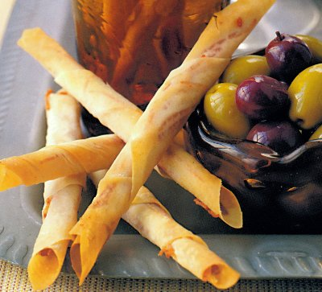

# Parma ham mikados

*These little canapés are so delicious that they are likely to disappear quickly. Serve three or more per person with green and black olives.*

**Makes:** 12

## Ingredients
- 12 filo squares (12 x 10 cm)
- 12 very small, thin slices of Parma ham
- 100 grams softened butter
- 30 grams strong Dijon mustard

## Directions
1. Preheat the oven to 180°C.
1. Cut each slice of Parma ham into fine julienne, keeping them separate.
1. Mix the softened butter with the mustard and brush both sides of the filo squares very lightly with the mixture.
1. Lay a filo square on the work surface with one corner facing you and arrange one shredded Parma ham slice on top, crosswise to cover the filo.
1. Lift up the corner nearest to you and roll up the filo to enclose the ham, pressing to make a small roll the thickness of a pencil.
1.Place on a lightly oiled baking sheet and repeat with the rest of the filo squares and ham.
1. Bake the mikados in the oven for 2 minutes.
1. As soon as they are cooked, transfer them to a wire rack with a palette knife and serve whilst still warm.