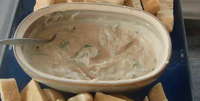

# Tahina Dip

*Tahina is not to be confused with Tahini. Tahini has a rich, slightly bitter and sweet taste, while Tahina has a more complex and tangy taste*

*This thick sesame seed paste is eaten both as a dip in its own right and added to other dips. One popular combination is Hummus bi Tahina, a dip made from chickpeas.*

**Preparation time**
- 10 minutes

## Ingredients
- 1 garlic clove
- salt
- 30 ml tahina paste
- juice of 1 lemon
- a few springs of parsley (chopped, to garnish)

## Directions 
1. Crush the garlic with a teaspoon of salt in a mortar.
1. Stir the tahina well so that any oil mixes with the thick paste.
1. Mix the garlic in with the tahina.
1. Add the lemon juice gradually, stirring all the time. The colour and texture of the tahina will change while mixing.
1. Add some water a little at a time, stirring until it is completely incorporated until the paste is slightly thicker than double cream.
1. Serve in shallow bowls, garnished with chopped parsley.

