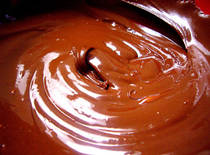

# Chocolate crème pâtissière

*A classic French tartlet filling, that also forms the basis of other classic sauces. Add a little cocoa or coffee powder to the custard instead of the vanilla to give you a chocolate or coffee-flavoured cream. If you use cocoa, use a little less flour and add a touch more sugar.*

**Yield:** 750 grams

## Ingredients
- 6 egg yolks
- 125 grams sugar
- 40 grams flour
- 500 ml milk
- 1 vanilla pod (split length-ways)
- 75 grams chocolate (grated)

## Method
1. Place the egg yolks and about one-third of the sugar in a bowl and whisk until they are pale and form a light ribbon. 
1. Sift in the flour and mix well.
1. Combine the milk, the remaining sugar and the split vanilla pod in a saucepan and bring to the boil. 
1. As soon as the mixture bubbles, pour about one-third onto the egg mixture, stirring all the time. 
1. Pour the mixture back into the pan and cook over a gentle heat, stirring continuously. 
1. Heat gently for 2 minutes, then tip the custard into a bowl.
1. Stir in the chocolate until it has completely melted.
1. If needing to cool the custard before using, place the bowl over a larger bowl of iced water, stirring occasionally.
1. If leaving to cool naturally then dust lightly with icing sugar, or dot with flakes of butter to prevent a skin forming as the custard cools.