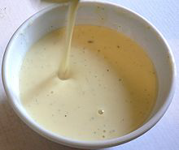

# Crème anglaise

*Crème anglaise (French for "English cream") is a light pouring custard used as a dessert cream or sauce.*

*Crème anglaise is thought to have origins evolving from ancient Romans who used eggs as thickeners to create custards and creams*

**Yield:**  750ml

## Ingredients
- 250 ml milk
- 250 ml cream
- 125 grams caster sugar
- 1 pod vanilla (split length-ways)
- 6 egg yolks

## Method
1. Scrape the seeds out of the vanilla pod and put them in to the milk.
1. Put the milk, cream, two thirds of the sugar and the vanilla pod into a heavy-based saucepan and slowly bring to the boil.
1. Meanwhile, whisk the egg yolks and remaining sugar together in a heatproof bowl. 
1. Continue to whisk until the mixture becomes pale and has a light ribbon consistency.
1. Pour the boiling milk on to the egg yolks, whisking continuously, then pour the mixture back in to the saucepan.
1. Cook over a very low heat, stirring with a wooden spatula. 
1. Do not let the mixture boil or it will curdle.
1. The crème anglaise is ready when it has thickened slightly - just enough to coat the back of the spatula. 
1. Immediately take off the heat.
1. Unless you are serving the crème anglaise warm, strain through a fine sieve into a bowl set over crushed ice to cool, stirring occasionally to prevent a skin forming.

### Chocolate crème anglaise
1. Stir 60 grams melted good-quality bitter chocolate into the milk as you warm it.

### Coffee crème anglaise
1. Stir 1 tablespoon of instant espresso powder into the hot milk

### Ginger crème anglaise
1. Infuse the milk with 20 grams peeled and finely sliced fresh ginger root rather than vanilla.

### Spiced crème anglaise
1. Infuse the milk with 4 or 5 star anise instead of vanilla.

### Mint crème anglaise
1. Infuse the milk with a bunch of fresh mint instead of vanilla. The freshness of this goes well with berries or truffle cake.

### Pistachio crème anglaise
1. Soak 200 grams of fresh pistachio nuts in water for 24 hours, then crushed in a pestle and mortar to make a paste. 
1. Pour one third of the hot crème anglaise onto the paste, stirring with a whisk, then stir into the rest of the crème anglaise. 
1. Purée in a blender for 3 minutes, and cool over crushed ice. This is superb with poached pears.