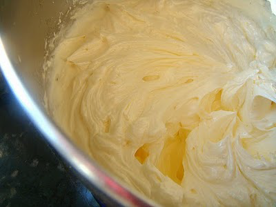

# Crème au beurre

*Butter-cream made with meringue italienne is a simple, easy to make cream, which can be used in many recipes, including all sorts of biscuit and sponge based desserts. Its great advantage is that it is neither too rich nor too sickly.*

**Yield:** 1.3kg

## Ingredients
### Meringue Italienne
- 250 ml water
- 700 grams sugar
- 50 grams glucose
- 9 egg whites

### For the Crème au beurre
- 1 kilogram butter (at room temperature)

## Method
1. Using the ingredients, make one quantity of Meringue Italienne.
1. When the meringue is almost cold, set the mixer on low speed and beat in the butter, a little at a time. 
1. Beat for about 5 minutes until the mixture is very smooth and homogeneous.