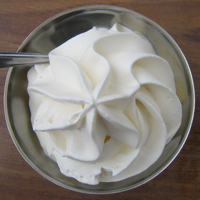

# Crème chantilly

*Crème Chantilly is used to lighten and enrich numerous creams - the Crème pâtissière in an Alméria for example. It can also be served just as it is and will complement many desserts, fruits or ice creams.*

**Yield:** 600 grams

## Ingredients
### For all the creams
- 500 ml whipping cream (well chilled)
- 50 grams icing sugar
- 2 drops vanilla extract (optional)

### For the chocolate cream
- 150 grams  plain chocolate

### For the coffee cream
- 1 tablespoon hot milk
- 1 tablespoon coffee extract (or 2 tablespoons instant coffee)

## Method
### Crème Chantilly
1. Combine the well chilled cream with the sugar and vanilla in a chilled mixer bowl and beat at a medium speed for 1 or 2 minutes. 
1. Increase the speed and beat for 3 or 4 minutes, until the cream begins to thicken. 
1. Do not over beat, or the cream may turn into butter. 
1. It should be a little firmer than ribbon stage.

### Chocolate Chantilly
1. Melt the chocolate in a double boiler, the temperature should not exceed 35°C. 
1. Remove from the heat and whisk in one-third of the plain Crème Chantilly. 
1. Fold gently and delicately into the remaining Crème Chantilly. 
1. Do not overwork the mixture.

### Coffee Chantilly
1. Dissolve the coffee in the hot milk, and allow to cool. 
1. Add it when you beat the cream.