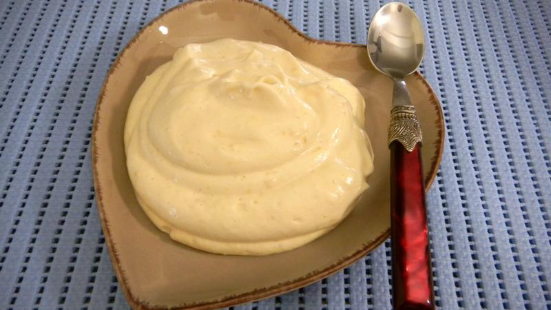

# Crème chiboust

**Yield:** 1.3kg

## Ingredients
### For the Crème pâtissière
- 6 egg yolks
- 80 grams sugar
- 30 grams custard powder
- 350 ml milk
- half a vanilla pod

### For the Meringue Italienne
- 80 ml water
- 360 grams sugar
- 30 grams glucose
- 6 egg whites

### For the Crème chiboust
-  50 ml Grand Marnier

## Method
1. Using the ingredients, make a quantity of Crème pâtissière and Meringue Italienne
1. Stir in the alcohol into the Crème pâtissière, and with a whisk, stir in one-third of the Meringue Italienne . 
1. Then, with a spatula, gently fold in the remaining Meringue Italienne until the mixture is completely homogeneous.
1. Do not overwork, or the cream will collapse and lose its lightness.

**Note**: You must use this cream as soon as you have mixed in the meringue italienne, so it is essential to have the rest of the dessert ready before finishing the Crème Chiboust.
