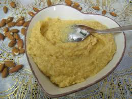

# Crème d'amande

**Yield:** 1kg

## Ingredients
- 250 grams butter
- 500 grams [Tant pour tant](../../base-ingredients/baking/tant-pour-tant.md)
- 50 grams flour
- 5 eggs
- 50 ml rum (optional)

## Method
1. Work the butter with the beater or spatula until very soft. 
1. Still beating, work in the tant pour tant and the flour, then the eggs one by one, beating between each addition. 
1. The mixture should be light and homogeneous. 
1. Stir in the rum.