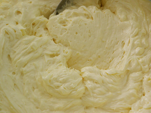

# Crème Mousseline

**Yield:** 1.3kg

## Ingredients
- 750 grams [Crème pâtissière](./creme-patissiere.md) (without flavouring)
- 250 grams butter (cut into pieces)
- flavouring of your choice (caramel, chocolate, coffee, praline, Grand Marnier)

## Method
1. As soon as the Crème pâtissière is cooked, take the pan off the heat and beat in one-third of the butter. 
1. Pour into a bowl over cold water and ice, stirring occasionally to prevent a skin from forming.
1. Place the remaining butter in the bowl of the mixer and beat at a low speed for 3 minutes, until rather pale. 
1. Increase the speed to maximum, and add the cooled Crème pâtissière, a little at a time. 
1. Beat for 5 minutes until the cream is perfectly light and creamy.
1. Add the flavouring of your choice, or leave the cream plain. It is now ready to use.