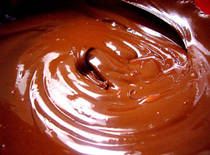

# Crème Pralinée

*This is one of those creams which seems particularly delicious in winter. Its delicate, nutty flavour makes it perfect for filling all kinds of biscuit and sponge based desserts.*

**Yield:** 1.25 kg

## Ingredients
- 500 grams [Crème pâtissière](./creme-patissiere.md)
- 500 grams [Crème Chantilly](./creme-chantilly.md)
- 150 grams praline (crushed)
- 100 grams hazelnuts (shelled)
- 1 pinch icing sugar

## Method
1. In a bowl, combine one-third of the Crème pâtissière with the praline and whisk together until thoroughly mixed. 
1. Add the rest of the Crème pâtissière and mix well again using the whisk.
1. Using a spatula, gently fold in the Crème Chantilly.
1. If you want to add hazelnuts to the mixture, first place them under a very hot grill to detach the papery skin, then rub them in a cloth to remove the skin completely. 
1. Arrange the nuts in a grill pan, sprinkle with the icing sugar and replace under the grill until lightly caramelized. 
1. Leave to cool completely.
1. When the nuts have cooled, chop them with a knife, or crush coarsely with a rolling pin.
1. Fold the, into the Crème Pralinée at the very last moment so that they remain crunchy.