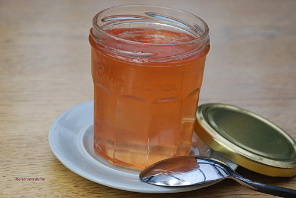

# Gelée de pommes

**Yield:** 500 ml 

## Ingredients
- 500 ml  water
- 250 grams sugar
- 500 grams Cox's apples
- 6 leaves gelatine

## Method
1. Pour the water into a large saucepan and add the sugar. Heat until the sugar has dissolved completely and is beginning to boil, stirring with a whisk from time to time. 
1. Skim the surface if necessary.
1. Soak the gelatine leaves in cold water for 20 minutes then drain.
1. Wash the apples and coarsely chop, including the core and drop them into the boiling sugar syrup. 
1. Cover the saucepan and simmer for about 7 minutes. 
1. Take the pan off the heat and push the apples to one side so that you can drop in the drained gelatine and dissolve it. 
1. When it has dissolved, pass the mixture carefully through a conical strainer into a bowl.
1. Use the jelly as a glaze for various desserts when it is cold, but before it begins to set.