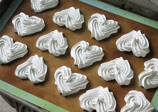

# Meringue Francaise (French Meringue)

*This meringue is light and fluffy, and melts in the mouth.*

## Ingredients
- 4 egg whites
- 125 grams sugar
- 125 grams icing sugar (sifted)

## Method
1. Preheat the oven to 120°C.
1. Whisk the egg whites until soft peaks form. 
1. Beat in the sugar, a little at a time and continue to beat for 10 minutes. 
1. The mixture should be firm and very smooth and shiny. 
1. Gradually sift in the icing sugar, folding it gently into the mixture with a slotted spoon. 
1. Do not overwork the mixture.
1. Pipe or spoon the mixture into a baking parchment or lightly buttered and floured greaseproof paper, using 2 soup spoons or a piping bag fitted with the appropriate nozzle.
1. Lower the oven temperature to 100°C and cook the meringues for 1 hour 45 minutes. 
1. The meringues are ready when the top and bottom are dry. 

### Meringue discs
1. On the baking parchment draw equal circles with a dark pencil, turn over the parchment and use these circles as a guide for the meringues.
1. Use a palette knife to make 4 mm high circles, and use these to construct a tower of cream and fruit meringues.