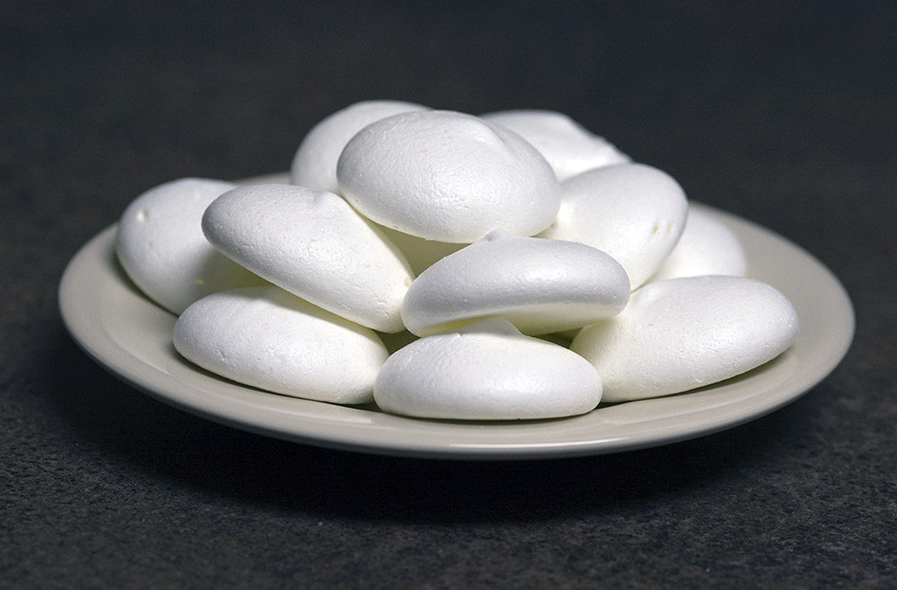

# Meringue Suisse (Swiss meringue)

*This meringue has a firmer, more solid texture than French meringue and is perfect for making decoration or for desert bases. It is not as delicate and melting as French meringue*

## Ingredients
- 4 egg whites
- 300 grams sugar

## Method
1. Preheat the oven to 120°C
1. Combine the egg whites and sugar in a mixing bowl. 
1. Stand the bottom of the bowl in a bain-marie set over a direct heat. 
1. Beat the mixture continuously until it reaches a temperature of about 40°C.
1. Remove the bowl from the bain-marie and continue to beat until the mixture is completely cold.
1. Spoon the mixture onto baking parchment or lightly buttered and floured greaseproof paper, using 2 soup spoons, or use a piping bag fitted with different nozzles to pipe it into various shapes and sizes.
1. Lower the oven temperature to 100°C and cook the meringues for 1 hour and 45 minutes. 
1. They are ready when both the top and the bottom are dry.