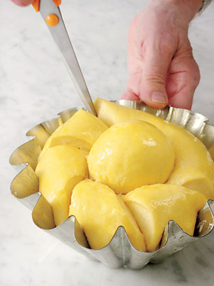

# Brioche dough

*This classic French dough can be frozen, well wrapped, for up to 2 weeks.*

*You will need a buttered brioche mould, measure 16 cm across the top, 8 cm across the base once the dough has rested in the refrigerator.*

**Yield:** 1.2kg

## Ingredients
- 70 ml tepid milk
- 15 grams fresh yeast
- 500 grams plain flour
- 15 grams fine salt
- 6 eggs
- 350 grams butter (slightly softened)
- 30 grams caster sugar
- eggwash (1 egg yolk mixed with 1 tablespoon milk)

## Method
1. Put the milk and yeast into a bowl and stir to dissolve the yeast.
1. Put the flour, salt and eggs into an electric mixer fitter with a dough hook and pour in the milk and yeast mixture.
1. Mix on low speed to combine and knead the dough for 5 minutes.
1. Scrape down the sides of the bowl with a rubber spatula, then knead at medium speed for about 10 minutes.
1. By this stage, the dough should be smooth, elastic and well amalgamated.
1. Meanwhile, in another bowl, mix the butter and sugar together well.
1. Add a few small pieces to the dough, then with the mixer running at low speed, add the rest, a piece at a time.
1. When the butter mixture is incorporated, increase the speed and work for 6 - 10 minutes until the dough is very smooth and shiny, and comes away from the bowl with perfect elasticity.
1. Remove the dough hook, leaving the dough in the bowl.
1. Cover with a tea towel and leave to rise at approximately 24°C for 2 hours until the dough has doubled in volume.
1. Knock the dough back by flipping it over 2 or 3 times with your hand.
1. Cover the bowl again and refrigerate for several hours (but not more than 24 hours).
 
### To shape a large brioche
1. Divide 600 grams of dough into two-thirds (400 grams) and one-third (200 grams).
1. Shape the larger piece into a ball and place in in the bottom of the mould.
1. Press 2 fingers into the centre of the dough to make a deep indention, forming a large ring doughnut shape. 
1. Shape the small piece of dough into a ball and roll it at an angle into an elongated oval.
1. Lightly flour your index and middle fingers, then gently press the small ball into the indentation so that two thirds of the small ball is above the larger ring.
1. Lightly brush the dough with the eggwash.
1. Leave the brioche to rise at approximately 24°C for about 1½ hours until it has at least doubled in volume.

### To bake the brioche
1. Preheat the oven to 200°C.
1. Working from the outside inwards, brush the brioche very lightly with the eggwash.
1. Dip a pair of very sharp scissors into cold water and make six 3 cm deep cuts around the body of the dough.
1. Immediately bake the brioche for 15 minutes, then lower the oven to 170°C and bake for another 30 minutes.
1. Leave the brioche in the mould for 5 minutes, then unmould it onto a wire rack to cool.