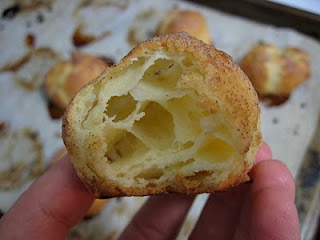

# Pâte à choux (Choux Pastry)

*Choux pastry is enormously versatile, which makes it a marvelous, indispensable component of all types of cooking and patisserie.*

**Yield:** 22

## Ingredients
- 125 ml water
- 125 ml  milk
- 100 grams butter (cut into small pieces)
- 3 grams fine salt
- 5 grams sugar
- 150 grams flour
- 4 eggs

## Method
1. Preheat the oven to 220°C
1. Put the water, milk, diced butter, salt and sugar in a saucepan, set over a high heat and boil for 1 minute, stirring with a spatula. 
1. Take the pan off the heat and, stirring all the time, quickly add the sifted flour.
1. The next stage - the 'drying out' - is vitally important if you want to make good choux paste. 
1. When the mixture is very smooth, replace the pan over the heat and stir with the spatula for 1 minute.
1. The paste will begin to poach and some of the water will evaporate. Be careful not to let the paste dry out too much, or it will crack during cooking and your buns or éclair will not be perfectly smooth. 
1. Tip the paste into a bowl.
1. Immediately beat in the eggs, one at a time, using a spatula. If you do not want to use it immediately, spread one-third of a beaten egg over the surface to prevent a skin forming, which can happen after a few hours.
1. Choose an appropriate plain nozzle to pipe out your chosen shape - small or large choux buns or éclair.
1. Pipe out the paste on baking parchment or a greased baking sheet. 
1. If you like, glaze the shapes and make them lightly with the back of a for, dipping it into the glaze each time.
1. Bake in a preheated oven, then open the door slightly (1-2 cm) after about 4-5 minutes and leave it ajar. 
1. Cooking time will vary from 10-20 minutes, depending on the size of the buns.