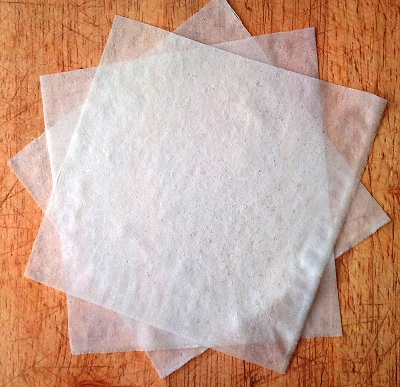

# Filo pastry

*As with all pastry, mastering filo is very satisfying. The difficulty of rolling the dough to the required thinness of only 0.5 mm is not insurmountable, but it's certainly a challenge.*

*Filo pastry dries out very quickly, so it is essential to cover it with a damp tea towel. Once the pastry has been made, it should be kept wrapped up in a damp tea towel and rested in the refrigerator and used within 24 hours.*

*Most recipes call for interleaving layers of filo, these sheets will need to be brushed generously with melted butter whilst assembling the required dish.*

**Yield:**  780 grams

## Ingredients
- 400 grams plain flour
- 6 grams fine salt
- 330 ml water (heated to 50°C)
- 30 ml olive oil
- cornflour (to dust)

## Method
### Make the dough
1. Combine the flour, salt and water in the bowl of an electric mixer fitter with a dough hook and mix at low speed.
1. As soon as the ingredients start to come to together, pour in the oil in a thin stream.
1. Stop mixing as soon as the dough is amalgamated.
1. Use a spatula to scrape down any dough sticking to the sides of the bowl and the dough hook.
1. Switch the motor to medium speed and work the dough for 3 - 4 minutes.
1. It will almost come away from the bowl when it is fairly soft and slightly sticky,

### Rest the dough
1. Put the dough on the work surface and shape into a ball.
1. Divide the dough into pieces about 60 grams each.
1. Shape each piece again into separate balls and place on a baking sheet dusted with cornflour, spacing them several centimetres apart.
Cover with cling film and leave to rest somewhere fairly cool (14 - 16°C) for at least two hours before using.

### Rolling the pastry
1. Lightly dust a 60 cm round wooden board with cornflour and place a ball of filo in the middle.
1. Using a long thin wooden pole or piece of doweling as a rolling pin, roll into a 14 - 16 cm disc.
1. From the point onwards, press down with your hands on each end of the pole to stretch the pastry sideways.
1. It is essential to keep dusting the top of the filo as you stretch it.
1. As soon as the sheet of filo is the perfect thinness (0.5 mm), lay it on a baking sheet and immediately cover with a lightly dampened teat towel to prevent it from drying out.
1. Make another sheet of filo using another ball of dough.
1. Dust the first sheet with cornflour, then place the second sheet on top and cover this sheet with the dampened tea towel.
1. Continue this way until you have used all the pastry, covering the final sheet with the dampened tea towel.