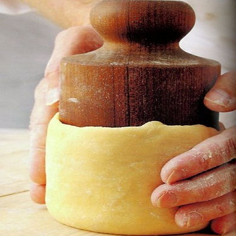

# Pâte moulée (Raised pie pastry)

*This pastry is best made at least two hours in advance, ideally 24 hours before you use it. *

**Serves:** 950 grams

## Ingredients
- 500 grams plain flour
- 20 grams salt
- 200 grams lard (cut into small pieces and softened)
- 5 egg yolks (mixed with 110 ml cold water)

## Method
1. Put the flour on the work surface and make a well.
1. Place the salt and lard in the centre.
1. Use your fingertips to mix and soften the ingredients in the well, gradually drawing in the flour and mixing with your fingertips.
1. When the dough has a fine grainy texture, make a well in the middle.
1. Gradually pour the egg yolks and water mixture into the well, mixing with your fingertips.
1. When the dough is well amalgamated, push it away from you 4 or 5 times with the heel of your hands to make it homogeneous.
1. Roll into a ball, wrap in cling film and refrigerate for at least 2 hours.
1. If it has rested in the refrigerator for a while, take it out an hour before rolling.