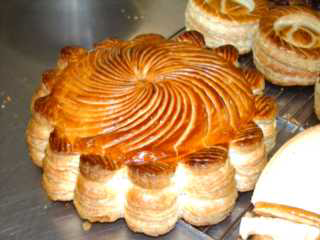

# Feuilletage (puff pastry)

*A very light pastry made in layers that expand when cooked, leaving large air pockets inside. Used for sweet or savoury dishes.*

*This pastry can be used as a base and topped with vegetables, tomatoes, ratatouille and cooked again.*

**Yield:** 1.25 kg

## Ingredients
- 500 grams flour
- 200 ml ice cold water
- 12 grams salt
- 25 ml white wine vinegar
- 50 grams butter (melted)
- 400 grams butter (very cold)

## Method
### The dough
1. Put the flour on the work surface and make a well in the centre. Pour in the water, salt, vinegar and melted butter and work together with your fingertips. 
1. Using your left hand, gradually draw in the flour and mix well. 
1. When all of the ingredients are well mixed, work the dough with the palm of your hand until it is completely homogeneous, but not too firm. 
1. Roll it into a ball and cut a cross in the top to break elasticity. 
1. Wrap in greaseproof paper or polythene and chill in the fridge for 2-3 hours.

### Shaping
1. Lightly flour the work surface. 
1. Roll out the ball of dough in four different places, so that it looks like 4 large 'ears' around a small head. 
1. Hit the chilled butter several times with a rolling pin, so that it is supple but still firm and very cold. 
1. Place it on the 'head' so that it covers it with no overhang. 
1. Fold the four 'ears' over the butter to cover it completely.
1. Chill in the fridge for 30 minutes to bring the butter and the dough to the same temperature.

### The turns
1. Lightly flour the work surface, then progressively roll the dough gently away from you into a rectangle about 70 x 40 cm. Fold over the ends to make 3 layers. This is the first turn.
1. On the lightly floured surface, give the rectangle one-quarter turn and again progressively roll it gently away from your into a 70 x 40 cm rectangle. This is the second turn.
1. Wrap the dough in greaseproof paper or polythene and place in the fridge for 30 minutes to firm up.
1. Make 2 more turns as above, then wrap the dough and refrigerate for 30 minutes to 1 hour.
1. Make 2 more turns, bringing the total to 6. The pastry is now ready to use.