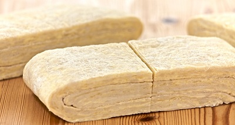

# NaRough puff pastrye

**Serves:** 1.2kg

## Ingredients
- 500 grams plain flour
- 500 grams butter (very cold, cut into small cubes)
- 1 teaspoon salt
- 250 ml water (ice cold)

## Method
### Preparing the pastry
1. Put the flour in a mound on the work surface and make a well.
1. Put in the butter and salt and work them together with the fingertips of one hand, gradually drawing the flour into the centre with the other hand.
1. When the cubes of butter have become small pieces and the dough is grainy, gradually add the iced water and mix well until it is all incorporated, making sure you don't overwork the dough.
1. Roll it into a ball, wrap it in cling film and refrigerate for 20 minutes.

### The first two turns
1. Flour the work surface and roll out the pastry into a 40 x 20 cm rectangle.
1. Fold it into three and give it a quarter-turn.
1. Roll the block of pastry into a 40 x 20 cm rectangle as before, and fold it into three again.
1. These are the first 2 turns.
1. Wrap the block in cling film and refrigerate it for 30 minutes.

### The last two turns
1. Give the chilled pastry another 2 turns, rolling and folding as before.
1. This makes a total for 4 turns, and the pastry is now ready.
1. Wrap it in cling film and refrigerate for at least 30 minutes before using.