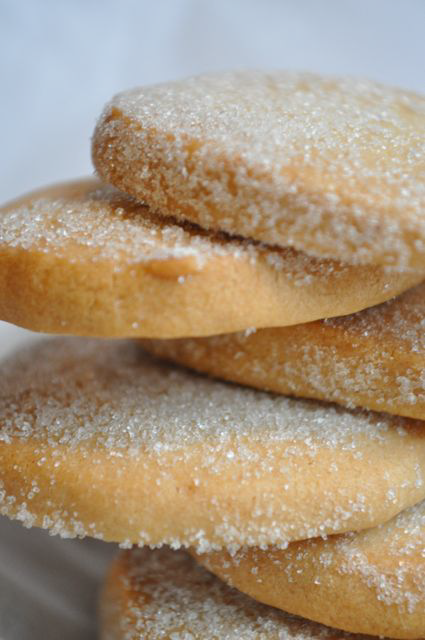

# Pâte sablée (Shortbread dough)

*Flour is always the last ingredient to be added to pâte sablée, so that the dough remains crumbly or 'short'.* 

*Once you have added the flour, do not overwork the dough, or it will become too elastic.*

*This recipe is very delicate; if you are using the dough to line a flan tin or to make sablés, you must work very fast, without over-handling the dough, as it softens extremely quickly.*

*Rolled out and cut into different shapes, this dough is perfect for petits fours secs.*

**Yield:**  680 grams

## Ingredients
- 250 grams flour(sifted)
- 200 grams butter
- 100 grams icing sugar(sifted)
- 1 pinch salt
- 2 egg yolks
- 1 drop vanilla essence

## Method
1. Sift the flour onto the work surface and make a well in the centre. 
1. Dice the butter and place it in the well, then work it with your fingertips until very soft.
1. Sift the icing sugar onto the butter, add the salt and work into the butter. 
1. Add the egg yolks and mix well. Gradually draw in the flour and mix until completely amalgamated.
1. Add the vanilla essence and rub into the dough 2 or 3 times with the palm of your hand.
1. Cover with polythene, and refrigerate for several hours before use.