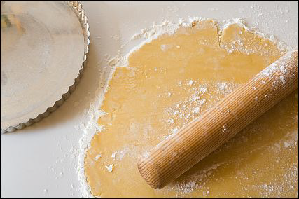

# Pâte brisée (Shortcrust)

*This light, crumbly, delicate shortcrust can be used as a substitute for puff pastry, but is always used to make classic flan and tartlet cases.*

**Yield:**  475 grams

## Ingredients
- 250 grams flour
- 150 grams butter (slightly softened)
- 1 egg
- 1 pinch caster sugar
- 1 teaspoon salt
- 1 tablespoon milk

## Method
1. Place the flour on the work surface and make a well in the centre.
1. Cut the butter into small pieces and place them in the well, together with the egg, sugar and salt.
1. Rub in all these ingredients with the fingertips of your right hand, then, with your left hand, draw in the flour a little at a time.  
1. When all the ingredients are almost amalgamated, add the cold milk. 
1. Knead the dough with the palm of your hand 4 or 5 times until completely mixed.
1. Roll the dough into a ball, flatten the top slightly, wrap in greaseproof paper or polythene and refrigerate for several hours before use.