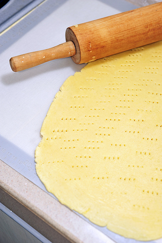

# Pâte sucrée (Sweet Short Pastry)

**Yield:** 520 grams

## Ingredients
- 250 grams flour
- 100 grams butter
- 100 grams icing sugar (sifted)
- 1 pinch salt
- 2 size 4 eggs (at room temperature)

## Method
1. Put the flour on the work surface and make a well in the centre. 
1. Cut the butter into small pieces, place them in the centre, then work with your fingertips until completely softened.
1. Add the sugar and salt, mix well together, then add the eggs and mix. 
1. Gradually draw the flour into the mixture.
1. When everything is thoroughly mixed, work the dough 2 or 3 times with the palm of your hand until it is very smooth.
1. Roll the dough into a ball, flatten the top slightly, wrap in greaseproof paper or polythene and refrigerate for several hours before use.