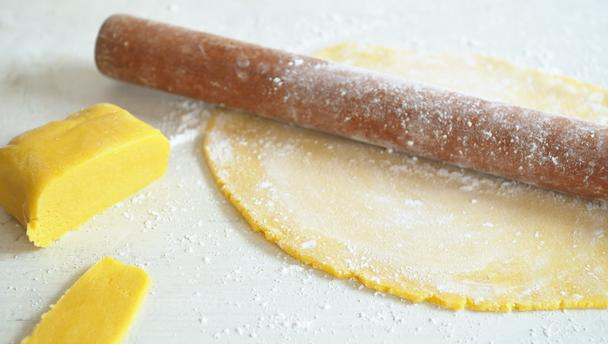

# Zesty orange marzipan

*Marzipan is a confection consisting primarily of sugar and almond meal. It is often made into sweets: common uses are marzipan-filled chocolate and small marzipan imitations of fruits and vegetables. It is also rolled into thin sheets and glazed for icing cakes, primarily birthday and wedding cakes and Christmas cakes. This use is particularly common in England, on large fruitcakes. Marzipan (or almond paste) may also be used as a cake ingredient, as in stollen.*

**Yield**: 500 grams

## Ingredients 
- 175 grams caster sugar
- 175 grams icing sugar
- 250 grams ground almonds 
- 1 orange (juice and zest separated)
- 1 egg
- 1 egg yolk 

## Method
1. Sift the sugars and ground almonds together, then stir through the orange zest. 
1. Beat together the egg and egg yolk, then add to the sugar mixture, stirring well.
1. Knead briefly to ensure the marzipan is completely mixed and pliable, adding a little orange juice if the mix is too dry, or icing sugar if too wet.
1. Place the cake on a cake board and use small balls of marzipan to plug any holes in the cake. Now glaze the cake with a thin layer of marmalade. 
1. Dust your work surface with a little icing sugar, then roll out the marzipan in one direction, keeping the pressure even and turning a ¼ turn every few rolls.
1. When large enough (about 40 cm in diameter for a 20 cm cake), roll the marzipan onto the rolling pin and lift onto the cake. 
1. Smooth the top with your palms and continue down over the sides of the cake, smoothing out any folds as you go. 
1. Trim with a knife where the marzipan meets the board, then leave to dry overnight. 