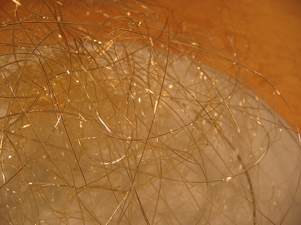

# Spun sugar

*Spun sugar can create a whole host of decorations that can enhance the look of a dessert. Finely spun nests can be created to surround an elegant dish.*

## Ingredients
- 250 grams sugar
- cold ice water bath
- chopsticks
- cold fork

## Directions
### Setting up
1. Overhang each chopstick on the counter top, approximately 6" apart. Secure with tape. 
1. Place the sheet pan on top of the chopsticks to weigh them down. 
1. Place the large piece of parchment on the floor directly underneath the chopsticks. This catches excess sugar 1. and helps with the clean up.

### Cooking the sugar
1. Place the stainless steel pot on the stove on medium-high heat. 
1. Put approximately half of sugar into the pot.
1. As the sugar begins to melt stir it gently with the wooden spoon.
1. Gradually add the remaining sugar so that the entire mixture continues to melt.
1. Once all of the sugar has melted, it will start to take on an amber color. If you lift up some of the caramel with your wooden spoon and let it drizzle off of the spoon back into the pot, you will be able to gauge the color of the caramel better. The darker it gets, the more bitter the flavor - don't let it get too dark.
1. When the desired color of caramel has been achieved, place the pot gently into the cold ice water bath for a couple of seconds to stop the cooking process. Remove from pot the ice bath.

### Checking the consistency
1. Wait a couple of minutes for the caramel to become a bit thicker as it cools. If it is too hot/runny, you will not be able to create a threads of sugar. Lift some of the caramelized sugar up with a spoon to see what stage you are at.

### Spinning the sugar
1. When the caramel is cool enough to form a fine thread, hold the forks (backs facing each other) and dip them into the caramel. 
1. Alternatively, you can use a cut wire whisk.
1. Using a quick flicking motion with your wrist, drizzle the caramel so it drapes over the two chopsticks.
1. Repeat this step over and over again until the desired amount of caramel has been spun.
1. Once the caramel is spun, it is cool enough to handle. You can pick it up and wrap it gently into a loose ball or shape it as you see fit. 
1. In humid conditions, spun sugar can melt easily so use it quickly or store in an airtight container.