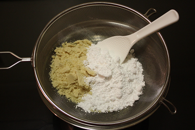

# Tant pour tant

*Tant pour tant (French for half and half) is a mixture of equal amounts of almond meal (ground almond) and superfine (castor) or confectioner’s (icing) sugar. It is ground in a food processor into fine granules or powder. The fine sugar helps to grind the nuts and also absorbs the oil from the nuts. Sift the almond powder through a fine sieve at least twice. *

## Ingredients
- 1 part icing sugar
- 1 part ground almonds
