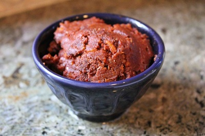

# Balti masala paste

*This mild paste forms the base for most Balti dishes. Using vinegar (rather than all water) to make the paste will enable you to preserve it in jars. As with all pickling, sterilise the jars. Top off the paste in the jar with hot oil and inspect after a few days to make sure that there is no mould.*

**Yield:** 675 grams

## Ingredients
- 200 grams Balti masala powder
- 200 ml white wine vinegar
- 200 ml vegetable oil

## Method
1. Place the ground masala spices in a bowl.
1. Add the vinegar and enough water to make a creamy paste.
1. Leave to stand for at least 10 minutes.
1. Heat the oil in a karahi or wok.
1. Add the paste to the oil.
1. Stir-fry the paste continuously to prevent it sticking until the water content is cooked out (this should take about 5 minutes).
1. Remove the karahi or wok from the heat, and leave to stand for 3 - 4 minutes. If the oil floats to the top, the spices are cooked. If not, add a little more oil and continue to cook and stir for a minute or so.
1. Bottle the paste in sterilised jars.
1. Heat up a little more oil and pour over the top of the paste to cover, seal the jars and store.