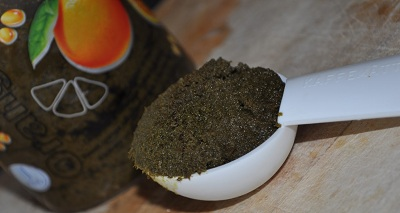

# Green balti masala paste

*This curry paste is green in colour because of its use of coriander and mint.*

**Yield:** 450 grams

# Ingredients
- 1 teaspoon fenugreek seeds
- 6 garlic cloves (chopped)
- 2 tablespoons fresh ginger (finely chopped)
- 40 grams fresh mint leaves
- 40 grams fresh coriander leaves
- 120 ml white wine vinegar
- 3 teaspoons salt
- 3 teaspoons tumeric
- 2 teaspoons chilli powder
- ½ teaspoon ground cloves
- 1 teaspoon ground cardamom seeds
- 120 ml vegetable oil
- 50 ml sesame oil

## Directions
1. Soak the fenugreek seeds in water overnight, they will swell and acquire a jelly-like coating.
1. Strain the fenugreek, discarding the water.
1. Add all the ingredients, except  the oils, in a blender and process to a purée.
1. Leave the mixture to stand for at least 10 minutes.
1. Heat the oil in a karahi or wok.
1. Stir-fry the paste continuously to prevent it sticking until the water content is cooked out (this should take about 5 minutes).
1. Remove the karahi or wok from the heat, and leave to stand for 3 - 4 minutes. If the oil floats to the top, the spices are cooked. If not, add a little more oil and continue to cook and stir for a minute or so.
1. Bottle the paste in sterilised jars.
1. Heat up a little more oil and pour over the top of the paste to cover, seal the jars and store.
