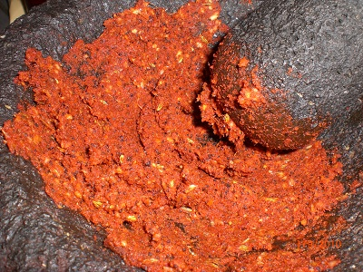

# Madrasi masala

*This curry paste is cooked in oil to help develop the wonderful fragrant flavours.*

**Yield:** 450 grams

## Ingredients
- 8 tablespoons coriander seeds
- 4 tablespoons cumin seeds
- 1 tablespoon black peppercorns
- 1 tablespoon black mustard seeds
- 11 tablespoons ground tumeric
- 4 tablespoons chilli powder
- 1 tablespoon salt
- 8 garlic cloves (crushed)
- 7 cm root ginger (peeled and finely grated)
- 60 ml cider vinegar
- 175 ml sunflower oil

## Directions 
1. Heat a heavy-based frying pan and dry-fry the coriander and cumin seeds along with the peppercorns for a couple of minutes, stirring continuously.
1. Add the mustard seeds and toss constantly over the heat until they start to pop and the mixture gives off a rich aroma. Make sure that the spices do not become too dark.
1. Grind the mixture to a fine powder in a mortar then add the tumeric, chilli and salt. Stir in the garlic, ginger and enough of the vinegar to make a paste.
1. Heat the oil in a large frying pan and fry the paste, stirring and turning it constantly until the oil begins to separate from the spicy mixture.
1. Spoon the masala into a clean jar.
1. Make sure that there is a film of oil floating on top (this will form an airtight seal and act as a preservative). This will keep refrigerated for up to 3 weeks.