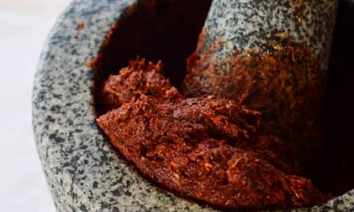

# Thai Masaman curry paste

*Kruang Kaeng Masaman*

*Originating from the Malaysian border area, this paste can be used with beef, chicken or duck.*

**Yield:** 175 grams
## Ingredients
- 12 large dried red chillies
- 1 lemon grass stalk
- 4 tablespoons shallots (chopped)
- 5 garlic cloves (chopped)
- 2 teaspoon fresh galangal (chopped)
- 1 teaspoon cumin seeds
- 1 tablespoon coriander seeds
- 2 cloves
- 6 black peppercorns
- 1 cm shrimp paste (wrapped in foil and warmed in a pan)
- 1 teaspoon salt
- 1 teaspoon soft brown sugar
- 2 tablespoons oil

## Directions
1. Snap the dried chillies and shake out most of the seeds, discarding the stems.
1. Soak the chillies in a bowl of hot water for 20 - 30 minutes.
1. Cut the tender lower portion of the lemon grass stalk into small pieces using a small sharp knife.
1. Place in a dry wok and add the chopped shallots, garlic and galangal and dry-fry for a few seconds until the mixture gives off a pleasant aroma.
1. Stir in the cumin and coriander seeds with the cloves and peppercorns and continue to dry-fry for 5 - 6 minutes, stirring constantly. Spoon the mixture into a large mortar.
1. Drain the chillies and add them to the mortar.
1. Use a pestle and grind the mixture finely, then add the shrimp paste with the salt, sugar and oil.
1. Pound to form a paste.
1. Use as required, and spoon any leftover paste into a jar and seal tightly. This will keep refrigerated for up to 2 months.