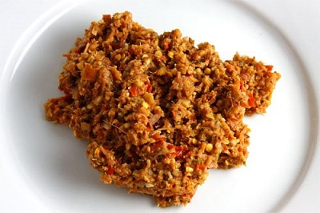

# Thai red curry paste

*Kruang Kaeng Dang*

*This wonderful classic curry paste from Thailand has an amazing fragrant characteristic that works beautifully with coconut based curries.*

**Yield:** 175 grams

## Ingredients
- 3 lemon grass stalks
- 10 fresh red chillies (seeded and sliced)
- 115 grams shallots (chopped)
- 4 garlic cloves
- 1 cm piece fresh galangal (peeled, sliced and bruised)
- stems from 4 fresh coriander sprigs
- 30 ml groundnut oil
- 1 teaspoon grated citrus rind
- 1 cm cub shrimp paste (wrapped in foil and warmed in a pan)
- 1 tablespoon coriander seeds
- 2 teaspoon cumin seeds
- 1 teaspoon salt

## Method
1. Slice the tender lower portion of the lemon grass stalks and bruise them. Put them in a large mortar and add the chillies, shallots, garlic, galangal and coriander stems.
1. Grind the herbs with a pestle, gradually adding the oil until the mixture forms a paste. 
1. Add the citrus rind and the shrimp paste, mixing well.
1. Dry-fry the coriander and cumin seeds in a frying pan until they release their rich aroma. then tip into a clean mortar and grind to a powder. 
1. Stir the powder into the spice paste and add the salt.
1. Use immediately.