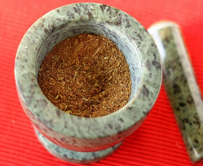

# Balti masala

*The amount of masala you use depends on your taste. For a spicy dish you should use about 2 level teaspoons per portion. For a mild dish you should use only 1 level teaspoon per portion.*

*The spices should be stored in a cool dark place, away from any sunlight as this will fade the colour and taste. Once stored the spices should ideally be left for about a month to mature, and used within six months.*

**Note:** spoon measurements here are heaped, rather than level.

**Yield:** 200 grams

## Ingredients

### Whole spices
- 4 tablespoons coriander seeds
- 2 tablespoons white cumin seeds
- 1 cinnamon stick
- 2 teaspoons fennel seeds
- 2 teaspoons black mustard seeds
- 2 teaspoons green cardamom seeds
- 1 teaspoon fenugreek seeds
- 1 teaspoon lovage seeds
- ½ teaspoon wild onion seeds
- 6 cloves
- 1 tablespoon dry fenugreek leaves
- 6 bay leaves
- 25 dry curry leaves
### Ground spices
- 4 teaspoons tumeric
- 4 teaspoons garlic powder
- 2 teaspoons ginger powder
 - 1½ teaspoons chilli powder

## Directions 
1. Heat a large wok or frying pan and add the whole spices and roast, shaking the pan continuously to evenly roast the spices. 
1. Once the spices become aromatic, remove from the heat and allow to cool.
1. Once cooled, place the spices in a mortar, and grind with a pestle to a fine powder.
1. Mix the remaining ground spices and tip into a jar and seal.