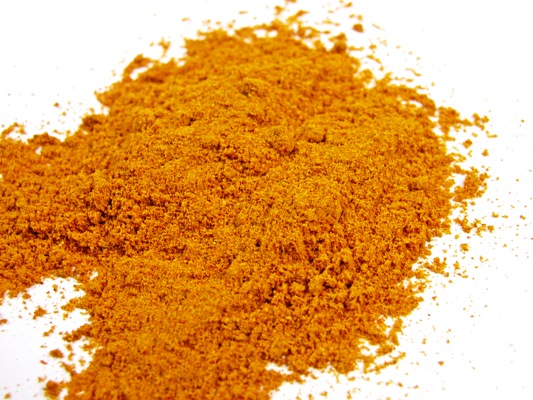

# Classic curry powder

*This classic curry powder mixture can be modified to suit personal tastes, but make sure you don't keep it too long, or it will lose it's aroma.*

**Yield:** 115 grams
## Ingredients
- 8 dried red chillies
- 7 tablespoons coriander seeds
- 4 tablespoons cumin seeds
- 2 teaspoons fenugreek seeds
- 2 teaspoons black mustard seeds
- 2 teaspoons black peppercorns
- 1 tablespoon ground tumeric
- 1 teaspoon ground ginger

## Directions 
1. Unless you like a fiery mixture, snap or cut the tops off the dried chillies and remove the seeds.
1. For a milder mixture, remove the seeds and stalks from the dried chillies.
1. Heat a heavy pan and dry-fry the chillies with the coriander, cumin, fenugreek and mustard seeds along with the black peppercorns over a medium heat until they give off a rich aroma. Shake the pan constantly so that the spices are evenly roasted.
1. Tip the roasted spices into a mortar and grind them to a smooth powder.
1. Stir in the tumeric and ginger.
1. Use immediately or store in an airtight jar protected from strong light.