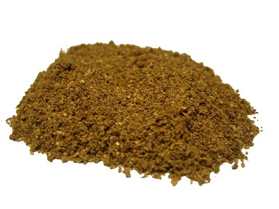

# Garam masala (Classic)

*Garam means "hot" and masala means "spices" so the spices used are those that heat the body such as chillies, pepper, cinnamon and cloves. Garam masala is added ad the end of cooking and sprinkled over dishes as a garnish.*

**Yield**: 50 grams

## Ingredients
- 10 dried red chillies
- 2 cinnamon sticks
- 2 curry leaves
- 2 tablespoons coriander seeds
- 2 tablespoons cumin seeds
- 1 teaspoon black peppercorns
- 1 teaspoon cloves
- 1 teaspoon fenugreek seeds
- 1 teaspoon black mustard seeds
- ¼ teaspoon chilli powder

## Method
1. Dry-fry the chillies, cinnamon sticks and curry leaves in a large heavy-based frying pan for 2 minutes, until the spices give off a rich aroma. Shake the pan constantly so that the spices roast evenly.
1. Add the coriander and cumin seeds, peppercorns, cloves, fenugreek and mustard seeds and continue frying for a further 8 - 10 minutes, shaking the pan as the spices darken and release their aroma.
1. Allow the mixture to cool slightly before pouring into a mortar to grind to a fine powder.
1. Add the chilli powder and use immediately, or store in an airtight container away from strong light. These spices will store for up to 4 months.