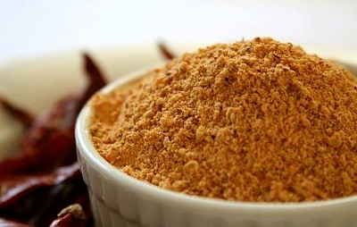

# Sambaar powder

*This blend of spices and dhal is used in South Indian cooking to flavour vegetable and lentil combinations, braised dishes and spicy broths. The powder also acts as a thickening agent.*

**Yield:** 105 ml
## Ingredients
- 8 dried red chillies
- 6 tablespoons coriander seeds
- 2 tablespoons cumin seeds
- 2 teaspoons black peppercorns
- 2 teaspoons fenugreek seeds
- 2 teaspoons white split gram beans (urad dhal)
- 2 teaspoons yellow split peas (channa dhal)
- 2 teaspoons yellow mung beans (mung dhal)
- 1 ½ tablespoons ground tumeric

## Directions 
1. Snap or cut the tops off the dried chillies and remove the seeds.
1. Dry-fry the chillies, coriander, cumin and fenugreek seeds along with the black peppercorns over a medium heat until they give off a rich aroma. Shake the pan constantly so that the spices roast evenly.
1. Pour the roasted spices into a bowl.
1. Add the pulses to the pan, and toast them without letting them burn.
1. Mix the spices and pulses together in a mortar, and grind them to a fine powder. 
1. Stir in the tumeric and use immediately or store in an airtight jar away from strong light.
