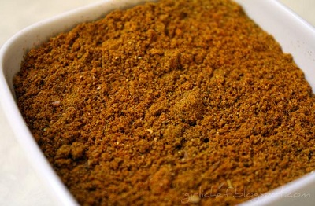

# Singapore curry powder

*Chillies are a key ingredient in this curry powder.*

**Yield:** 75 grams
## Ingredients
- 3 dried red chillies
- 6 tablespoons coriander seeds
- 1 tablespoon cumin seeds
- 1 tablespoon fennel seeds
- 2 teaspoons black peppercorns
- 1 cinnamon stick
- 4 green cardamom pods
- 6 cloves
- 2 teaspoons ground tumeric

## Method
1. Unless you like a fiery mixture, snap or cut the tops off the dried chillies and remove the seeds.
1. Heat a large heavy-based pan and add the coriander, cumin and fennel seeds along with the chillies and peppercorns. Add the cinnamon stick, cardamoms and cloves.
1. Dry-fry the spices over a medium heat, stirring continuously until the spices give off a rich aroma.
1. Remove from the heat and allow to cool.
1. Once cooled, break the cinnamon into small pieces and remove the seeds from the cardamom pods, discarding the pods.
1. Grind all the roasted spices to a fine powder in a mortar, stir in the tumeric and use immediately.

## Variation for use with fish or seafood.
- 2 dried red chillies
- 6 tablespoons coriander seeds
- 1 tablespoon cumin seeds
- 2 tablespoon fennel seeds
- 1 teaspoon fenugreek seeds
- 1 teaspoons black peppercorns
- 2 teaspoons ground tumeric