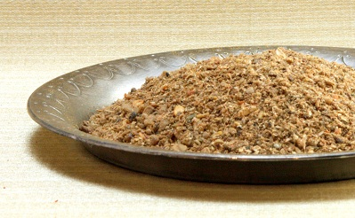

# Sri Lankan curry powder

*This curry powder has completely different characteristics from Indian variants. The spices are roasted separately, and chilli powder is used instead of whole dried chillies. The result is a rich, dark curry powder that is idea for dish, poultry, meat and vegetable curries.*

*In Sri Lanka, coriander, cumin, fennel and fenugreek seeds are roasted separately before being combined with roasted cinnamon, cloves and cardamom seeds. After grinding, chilli powder is stirred into the mixture, which is aromatic rather than fiery. Colour and presentation are key features in Sri Lankan cuisine, and you will often find red, yellow and even black curries artistically arranged around a central bowl of rice.*

**Yield:** 75 grams
## Ingredients
- 6 tablespoons coriander seeds
- 3 tablespoons cumin seeds
- 1 tablespoon fennel seeds
- 1 teaspoon fenugreek seeds
- 1 cinnamon stick
- 1 teaspoon cloves 
- 8 green cardamom pods
- 6 dried curry leaves
- 2 teaspoons chilli powder

## Directions
1. Dry-fry the coriander, cumin, fennel and fenugreek seeds separately because they all turn dark at different stages. Do not let the spices burn, remove them as soon as they give off a rich aroma.
1. Dry-fry the cinnamon stick, cloves and cardamom pods together for a few minutes until they give off a pungent aroma.
1. As soon as they are cool enough to handle, remove the seeds from the cardamom pods and place them in a 1. mortar. Add the remaining dry-fried ingredients, along with the curry leaves. Grind to a smooth powder.
1. Stir in the chilli powder and use immediately. 