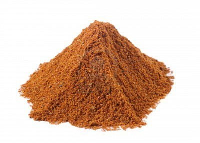

# Tandoori masala

*As with all pre-mixed masalas, this has the advantage of maturing during storage. Keep it in the dark in an airtight container, and it will keep for about 12 months.*

*The bright reds and oranges that are often associated with restaurant tandoooris and tikkas are phoney, requiring chemical colourings. Instead it is much better and healthier to use beetroot and annatto seed powders. If these are unavailable, then a teaspoon of red and half a teaspoon of sunset yellow food colouring could be used instead.*

**Note:** spoon measurements here are heaped, rather than level.

**Yield:** 200 grams

## Ingredients
- 2 tablespoons ground coriander
- 5 teaspoons ground cumin
- 5 teaspoons garlic powder
- 5 teaspoons paprika
- 4 teaspoons mango powder
- 6 teaspoons dried mint
- 3 teaspoons chilli powder
- 4 teaspoons beetroot powder (deep red colouring)
- 2 teaspoons annatto seed powder (yellow colouring)
- 2 teaspoons salt

## Method
1. Simply mix all the ingredients together and store
