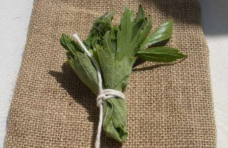

# Bouquet garni

*The bouquet garni(French for "garnished bouquet") is a bundle of herbs usually tied together with string and mainly used to prepare soup, stock, and various stews. The bouquet is cooked with the other ingredients, but is removed prior to consumption.*

## Ingredients
- 2 sprigs fresh thyme
- 2 dried bay leaf
- 6 sprigs fresh parsley
- 2 leaves oregano (or celery leaf)

## Method
1. Bundle together all the ingredients, leaving a bay leaf. 
1. Wrap this bay leaf around the base of the bouquet, and tie up with a piece of string
