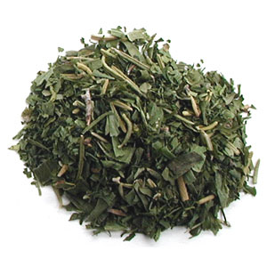

# Fines Herbes

*Fines herbes can be used in all sort of recipes, especially foods with delicate or subtle flavors like roasted or baked fish dishes, omelets, potatoes, soups or vinaigrettes. You could use fines herbes in preparing this herb baked chicken recipe.*

## Ingredients
- 1 sprig parsley
- 1 sprig chives
- 1 sprig tarragon