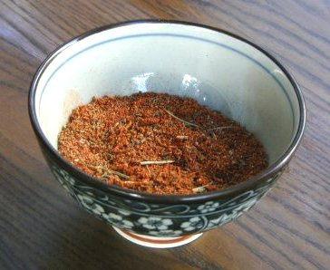

# Barbecue spice mix

*Rub this on chops, steaks or portions of chicken. To make a marinade, add the mixture to a glass of red or white wine. Add a few slices of onion and stir in 4 tablespoons of garlic infused oil.*

**Yield:** 50 ml / 4 tablespoons

## Ingredients
- 2 teaspoons celery seeds
- 1 teaspoon paprika
- 1 teaspoon grated nutmeg
- 1 teaspoon chilli powder
- 1 teaspoon garlic powder
- 1 teaspoon onion salt
- 2 teaspoon dried marjoram
- 1 teaspoon salt
- 2 teaspoon soft brown sugar
- 1 teaspoon ground black pepper

## Directions
1. Put the celery seeds in a mortar and grind to a powder with a pestle.
1. Tip the powder into a bowl and stir in the remaining ingredients.
1. Use the spice immediately.