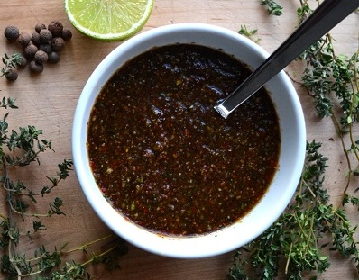

# Jamaican Jerk Marinade

*Give pork chops or chicken pieces a taste-lift with this delicious paste. Scotch bonnet chillies would be used in Jamaica, however you can substitute these hot chillies with milder variations.*

*This marinade is intended to cover meat, and allowed to rest for 8 hours before barbecuing.*

**Yield:** Sufficient for four meat pieces

## Ingredients
- 1 tablespoon oil
- 2 onions (finely chopped)
- 2 fresh red chillies (de-seeded and finely chopped)
- 1 garlic clove (crushed)
- 2.5 cm root ginger (freshly grated)
- 1 teaspoon dried thyme
- 1 teaspoon ground allspice
- 1 teaspoon Tabasco sauce
- 2 tablespoons rum
- juice and grated rind of 1 lime
- salt and black pepper

## directions
1. Heat the oil in a frying pan and add the onions, stirring over a medium heat for 10 minutes until they turn soft.
1. Stir in the chillies, garlic, ginger, thyme and allspice.
1. Fry for a further 2 minutes.
1. Stir in the Tabasco sauce, rum, lime juice and lime rind.
1. Simmer until the mixture forms a dark paste with a rich aroma. 
1. Season with salt and pepper and set aside to cool.
