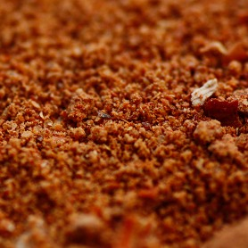

# Peri-peri marinade

*Peri-peri is a hot chilli sauce that originated in Portugal. It is widely used in South Africa and Mozambique, and makes a marvelous marinade that is particularly good with shellfish.*

*When used as a marinade for shellfish, allow the shellfish to marinate for about 30 minutes, and at least an hour for chicken. When the meat is cooking, periodically baste it with the remaining marinade.*

**Yield:** 75 ml
##Ingredients
- 1 fresh red chilli (de-seeded and chopped finely)
- half teaspoon paprika
- half teaspoon ground coriander
- 1 garlic clove (crushed)
- juice of 1 lime
- 2 tablespoons olive oil
- salt and ground black pepper

## Method
1. Put the chilli in a small bowl and stir in the paprika, ground coriander, crushed garlic and lime juice.
1. Whisk in the olive oil using a fork, and season to taste with salt and pepper.