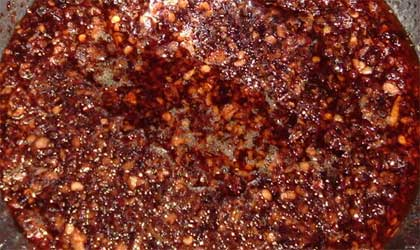

# Nam Prik Pao

*This is the universal Thai sauce, served solo, with rice or as a dip for fresh vegetables.*

**Yield:** 275 grams

## Ingredients
- 50 grams dried prawns
- 1 cm cube of shrimp paste (wrapped in foil and warmed in a hot pan)
- 4 garlic cloves (crushed)
- 4 fresh red chillies (de-seeded and sliced)
- 50 grams cooked prawns (peeled)
- 3 coriander sprigs
- 8 tiny baby aubergines
- 4 tablespoons lemon or lime juice
- 2 tablespoons Thai fish sauce
- 3 teaspoons soft light brown sugar

## Method 
1. Soak the dried prawns in water for about 15 minutes, drain and put in a mortar with the shrimp paste, garlic and chillies.
1. Pound with a pestle into a paste, then add the cooked prawns and coriander.
1. Continue pounding until combined.
1. Chop the aubergines roughly and gradually pound them into the sauce.
1. Add the lemon or lime juice, fish sauce and sugar to taste.

