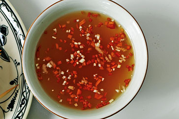

# Nuoc Cham

*In Vietnam, this fiery sauce used as a condiment, and serves much the same purpose as salt and pepper does in the west. Chillies are used exhaustively in Vietnamese cooking, especially in the centre of the country where it is believe that eating them frequently keeps mosquitos and marlaria at bay.*

**Yield:** 105 ml

## Ingredients
- 2 fresh red chillies (de-seeded)
- 2 garlic cloves (crushed)
- 1 tablespoon sugar
- 3 tablespoons Thai fish sauce
- juice of 1 lime

## Directions
1. Chop the chillies roughly and place them in a large mortar.
1. Use a pestle to grind the chillies into a paste.
1. Scrape the paste into a bowl, and add the garlic, sugar and fish sauce.
1. Stir in the lime juice to taste.