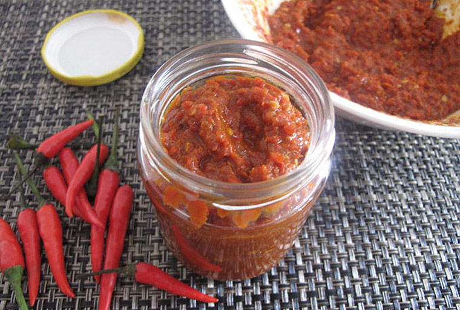

# Sambal belacan

*Hot chillies can hold their own against strong flavours, as this sambal proves. The shrimp paste gives it a pungent quality while the citrus juice adds a welcome sharpness. This sambal is often served with rice dishes, as the rice tempers the heat.*

**Yield:** 30 ml

## Ingredients
- 4 fresh red chillies (de-seeded and chopped)
- salt
- 1 cm cube of shrimp paste
- juice of half a lemon or lime

## Method
1. Put the chillies into a mortar.
1. Add a little salt, then use a pestle to pound them into a paste.
1. Warm the shrimp paste, either by moulding it on to the end of a metal skewer and heating it in a gas flame until the outside begins to look dry, or by wrapping the paste in foil and dry-frying for about 5 minutes, turning occasionally.
1. Add the shrimp paste to the chillies and pound to mix well.
1. Stir in lemon or lime juice to taste.