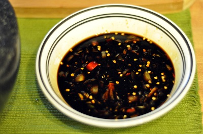

# Sambal kecap

*Frequently served as a dip with chicken or beef satay, instead of the more usual peanut sauce, this is also delicious with deep-fried chicken.*

**Yield:** 150 ml

## Ingredients
- 1 fresh red chilli (de-seeded and finely chopped)
- 2 garlic cloves (crushed)
- 4 tablespoons dark soy sauce
- 4 teaspoons lemon juice
- 2 tablespoons hot water

## Directions
1. Place the chopped chilli, crushed garlic and soy sauce in a small bowl.
1. Stir in the lemon juice, mix well and then blend with the hot water.
1. Cover and leave the sambal to stand for about 30 minutes before using.
1. 1 tablespoon of Taramind juice works equally well in place of the lemon juice.