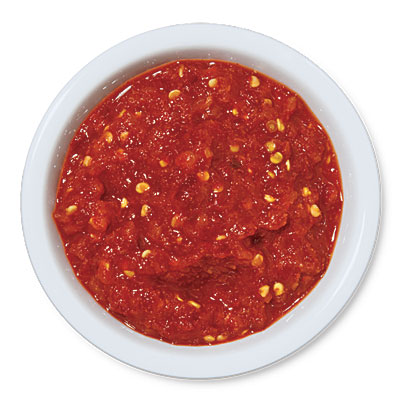

# Sambal oelek

*This Indonesian specialty is a very simple mixture, made from pounding hot chillies with salt. Taramind water is sometimes added, and Asian cooks will occasionally temper its heat by stirring ground roasted peanuts into the mixture.*

**Yield:** 450 grams

## Ingredients
- 450 grams fresh red chillies
- 2 teaspoons salt

## Method
1. Cut the chillies in half and remove the stems.
1. Using a sharp knife, scrape out and discard the seeds.
1. Bring a pan of water to the boil, add the chillies and cook for 5 - 8 minutes.
1. Drain the chillies and tip them into a food processor and process to a rough paste.
1. Add the salt, and mix gently.
1. Allow to cool before using.
